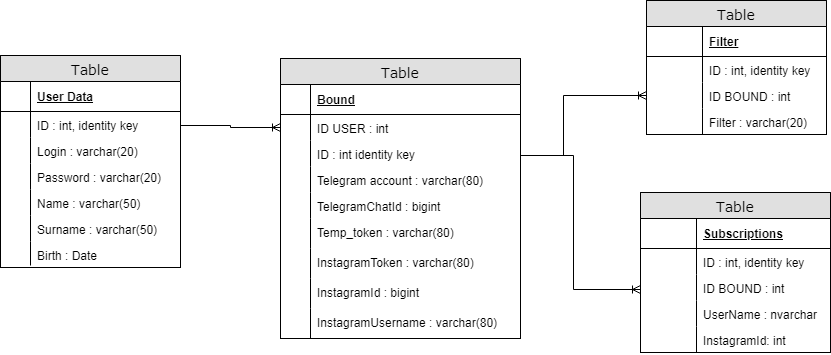

## База Данных ТЗ

### Описание

База данных хранит в себе информацию для авторизации пользователя , его минимальные личные данные(ФИ , ДР),  данные о фильтрах(предпочтениях) , и связках Телеграм - Инстаграм. Также содержит отдельную таблицу с разбиением всех просканированных пользователей на целевые аудитории.

### Архитектура БД

