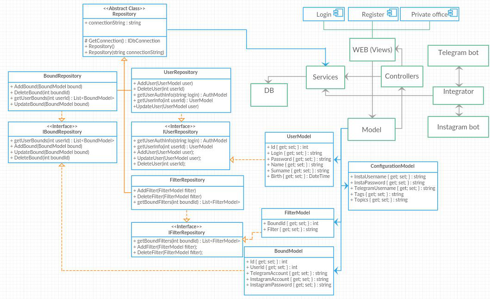

<h2>

Техническое задание

</h2>

### Описание

Бот следит за инстаграм-лентой пользователя. Когда кто-то из подписок пользователя постит фото определенной тематики (из списка предпочтений), он уведомляет его об этом через телеграм.
Пользователь может написать ответ на фото в тот же телеграм, который будет переслан в инстаграм как комментарий.

Распознавание тематики картинок указанной пользователем тематики по хештегам и с помощью Microsoft Cognitive Services или Google Vision API.

Также пользователю предоставляется web-интерфейс для настройки работы бота.

### Цели создания системы

1.	Построить продукт, расширяющий возможности пользователей Instagram и Telegram
2.	Создать возможность интегрирования двух многопользовательских систем
3.	Разработать WEB-платформу для управления пользовательскими настройками
4.	Создание клиентской базы данных с разделением на целевые аудитории, историей фильтрации контента(для использования таргетированной рекламы)
5.	Создание отдельной базы данных, состоящей из подписок пользователя и их интересов

### Основные функциональные возможности системы

**Фронт(для клиентов)**
1.	Возможность настраивать рассылку интересующего контента для Telegram.
2.	Возможность отвечать на посты через Telegram.
3.	Возможность добавления нескольких пар TelegramAccount : InstAccount
4.	Готовые шаблоны фильтров, для Instagram контента.
5.	Зарегистрироваться (Имя, Фамилия, Дата рождения, Аккаунт Телеграма, Аккаунт Инстаграма)
6.	Войти в систему(Логин, пароль)
7.	Окно обратной связи, отзыв о сервисе

**Бэкэнд**
1.	Один пользователь может создать несколько связок Telegram:Instagram
2.	Ответ на обратную связь
3.	Сервер сохраняет информацию в БД
4.	Сервер передает информацию об аккаунте Instagram’a и связки Telegram:Instagram  для работы бота.

**Instagram Бот**
1.	Бот получает информацию об аккаунте и фильтрах с сервера.
2.	Бот выполняет поиск по переданным фильтрам.
3.	После нахождения желаемого - отправляет сообщение интегратору
4.	Отправляет связку Telegram:Instagram интегратору
5.	Принимает ответ от интегратора для создания комментария.

**Интегратор**
1.	Интегратор обрабатывает сообщение от Instagram Бота и отправляет Telegram боту, с сообщением об аккаунте.
2.	Обрабатывает ответ пользователя и передает боту для создания комментария.

**Telegram Бот**
1.	Отправляет пост (фото и текст) пользователю
2.	Обрабатывает ответ, передавая его интегратору
3.	Интегратор передает ответ боту, для создания комментария.

### Диаграмма Архитектуры

